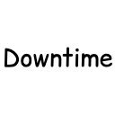

<p align="center">
  
</p>

# Downtime

[](https://github.com/mrailouis/downtime/releases)
[](https://modrinth.com/)
[](LICENSE)
[](https://www.minecraft.net/)
[](https://fabricmc.net/)

## About

Downtime adds to your experience by replacing the Kuudra rewards screen with a case-opening-style animation, because who needs good rates when you can gamba. It also keeps a running counter of exactly how much of your life you've spent watching it roll by.

## Features

- Case-opening reel animation for Paid Chest rewards.
- Configurable animation duration, blur strength, ticker sound and volume, and bait chance.
- Downtime tracker showing your cumulative time spent watching the animation.
- Custom settings GUI, with ModMenu and YACL compatibility for easy access.

## Commands

| Command | Description                                                 |
| --- |-------------------------------------------------------------|
| `/downtime` or `/dt` | Opens the settings GUI                                      |
| `/downtime time` | Tells you your current total downtime spent watching gamba. |

## Requirements

- Minecraft `26.1.2`
- [Fabric Loader](https://fabricmc.net/use/) `0.19.3+`
- [Fabric API](https://modrinth.com/mod/fabric-api)
- [Hypixel Mod API](https://modrinth.com/mod/hypixel-mod-api) (required)
- [ModMenu](https://modrinth.com/mod/modmenu) (optional, for accessing the config screen from the mods menu)

## Building from Source

```
git clone https://github.com/mrailouis/downtime.git
cd downtime
./gradlew build
```

For IDE setup, see the [Fabric Documentation page](https://docs.fabricmc.net/develop/getting-started/creating-a-project#setting-up) related to the IDE that you are using. I recommend IntelliJ IDEA. 

## Contributions
If for some reason you would like to contribute to this mod despite the fact that it is a single-feature mod, you may do so by forking the repo, branching off `main`, and opening a pull request. For anything bigger than a small fix, open an issue first so we're on the same page before you sink time into it. Please stick to the existing code style, see (STYLE.md).

## License

This project is licensed under the GNU General Public License v3.0. See [LICENSE](LICENSE) for the full text.
